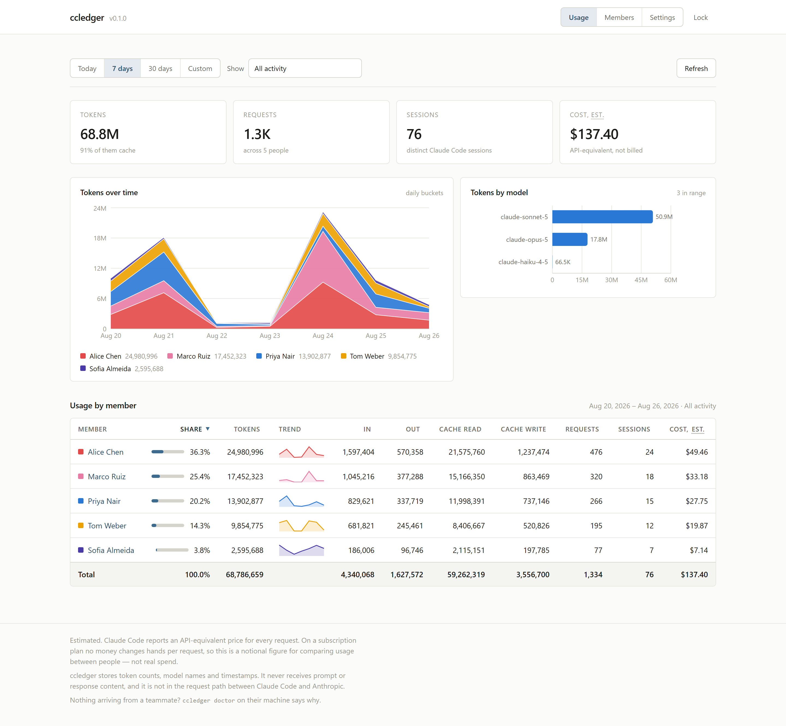
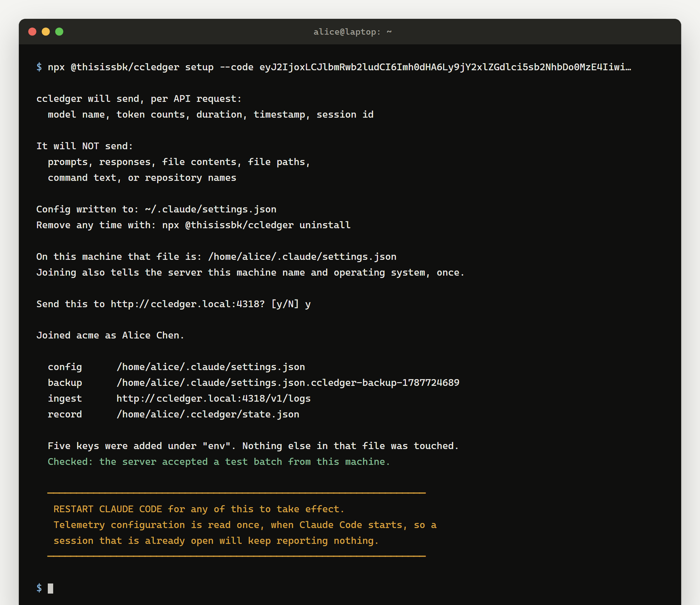

# ccledger

Team usage ledger for Claude Code. See who is using how many tokens.

[](https://github.com/shakibbinkabir/ccledger/actions/workflows/ci.yml)
[](https://www.npmjs.com/package/@thisissbk/ccledger)
[](LICENSE)
[](package.json)



> **ccledger is an independent open source project. It is not affiliated with,
> endorsed by, or sponsored by Anthropic.**

---

## What it does

Claude Code can export OpenTelemetry data about its own API calls. ccledger
runs a server that receives that data from everyone on your team, stores it in
one SQLite file, and shows per-person token usage, a model breakdown, and
trends over a date range.

It is built for teams of two to ten who share Claude Code access and cannot see
who is using what. Anthropic's per-user analytics is an Enterprise feature;
this covers the same question for everyone else.

## ccledger vs ccusage / CCMeter

Those tools read the session logs already on your disk and show you your own
usage on one machine. They are good at that, they need no server, and if that
is what you want you should use one of them.

ccledger is the team version. Every machine reports to one server you run, so
you get per-person attribution across the whole team in one place.

## Quick start

**On the machine that will hold the data** — a laptop on the office network, or
a VPS. Three commands. The package is scoped because npm holds the unscoped
name for an unrelated project; what it installs is still plain `ccledger`.

```console
$ npm install -g @thisissbk/ccledger
added 79 packages in 8s

$ ccledger serve

ccledger 0.1.0 · laptop mode · listening on http://localhost:4318

  ingest      http://ccledger.local:4318/v1/logs
  health      http://ccledger.local:4318/health
  database    /home/you/ccledger.db
  alert reset Europe/Berlin  (calendar day and week boundaries)

  Advertised over mDNS as ccledger.local — teammates need no setup for it.
  Teammates on this network reach ccledger at http://ccledger.local:4318

  WARNING  laptop mode serves plain HTTP. Tokens and telemetry cross the
           network unencrypted and anyone on it can read them. Use this
           mode only on a network you trust; run --mode=vps behind TLS
           for anything else.

  Invite a teammate:  ccledger invite <name>

  Admin token created.
  Only its hash is stored, so this is the one and only time it is shown.
  Save it somewhere before closing this terminal.

      cca_SVhcViVryfFYKGLuucXabK76LCAy4FGc

  Dashboard   http://localhost:4318/#token=cca_SVhcViVryfFYKGLuucXabK76LCAy4FGc

$ ccledger invite "Alice Chen"

Invite for Alice Chen

  endpoint    http://ccledger.local:4318
  join code   57TJ-576E-95EK
  expires     2026-08-27T05:57:17.525Z

Send them this line:

  npx @thisissbk/ccledger setup --code eyJ2IjoxLCJlbmRwb2ludCI6Imh0dHA6Ly9jY2xlZGdlci5sb2NhbDo0MzE4IiwiY29kZSI6IjU3VEotNTc2RS05NUVLIiwibmFtZSI6IkFsaWNlIENoZW4ifQ

The code works once and expires in 24 hours.
```

The server has to keep running to receive anything. See
[docs/install.md](docs/install.md) for both deployment modes, including the
Docker stack that gets you TLS and a restart policy.

**On each teammate's machine.** One command, and then a restart:



```console
$ npx @thisissbk/ccledger setup --code eyJ2IjoxLCJlbmRwb2ludCI6Imh0dHA6…

ccledger will send, per API request:
  model name, token counts, duration, timestamp, session id

It will NOT send:
  prompts, responses, file contents, file paths,
  command text, or repository names

Config written to: ~/.claude/settings.json
Remove any time with: npx @thisissbk/ccledger uninstall

On this machine that file is: /home/alice/.claude/settings.json
Joining also tells the server this machine name and operating system, once.

Send this to http://ccledger.local:4318? [y/N] y

Joined acme as Alice Chen.

  config      /home/alice/.claude/settings.json
  backup      /home/alice/.claude/settings.json.ccledger-backup-1787724689
  ingest      http://ccledger.local:4318/v1/logs
  record      /home/alice/.ccledger/state.json

  Five keys were added under "env". Nothing else in that file was touched.
  Checked: the server accepted a test batch from this machine.

  ──────────────────────────────────────────────────────────────────
   RESTART CLAUDE CODE for any of this to take effect.
   Telemetry configuration is read once, when Claude Code starts, so a
   session that is already open will keep reporting nothing.
  ──────────────────────────────────────────────────────────────────
```

Then quit Claude Code and start it again. Configuration is read once at
startup, so a session that was already open keeps reporting nothing. That is
the most common reason a new install shows no data, and it is the first thing
[`ccledger doctor`](docs/troubleshoot.md) checks.

## What it is not

- **Not a proxy.** ccledger never sits between Claude Code and Anthropic. It
  never reads, stores, or relays Claude credentials, and Claude Code keeps
  working normally when the ccledger server is down or unreachable.
- **Not content capture.** No prompts, no responses, no file contents, no file
  paths, no command text, no repository names. ccledger never sets the Claude
  Code variables that would turn any of that on, and `ccledger doctor` warns
  loudly if something else has. See [docs/privacy.md](docs/privacy.md).
- **Not an audit tool. Attribution is honor-system.** A teammate's token sits
  in a file on their own machine, and they can edit it, share it, or switch
  telemetry off. That is fine for splitting a bill fairly. It is not evidence,
  and it should not be used for compliance or performance review.
- **Not real billing. Every cost figure is an estimate.** The numbers are
  Claude Code's own per-request estimates, not amounts anyone was charged. On a
  subscription they are notional API-equivalent prices for work the
  subscription already covered. Every cost in the dashboard is labelled `est.`
  for that reason.
- **Does not track claude.ai usage.** The browser app and the desktop app
  export no telemetry, so ccledger cannot see them. Claude Code only. Reading
  that usage would mean intercepting credentials, which is out of scope
  permanently.
- **Not a per-prompt log.** One thing you ask for can produce several API
  requests, and Claude Code makes some on its own behalf — naming a session,
  compacting a transcript. Those are real tokens and they are counted, but a
  request is not a prompt. The dashboard can show the two separately.

## How it works

Claude Code has an OpenTelemetry logs exporter built in. `ccledger setup`
writes five environment keys into a teammate's `~/.claude/settings.json` that
point that exporter at your server and give it a bearer token. From then on
Claude Code posts OTLP/HTTP JSON batches to `POST /v1/logs` as it works. The
server parses each batch, drops the identity and content attributes before
anything is stored, and inserts one row per API request into SQLite, keyed on
the request id so a redelivered batch changes nothing. The dashboard is a
static page the same server hosts, reading aggregates back over `/api/*`.

```
  teammate's machine                     the machine you run
  ┌──────────────────────┐               ┌──────────────────────────┐
  │ Claude Code          │  OTLP/HTTP    │ ccledger serve           │
  │  OTel logs exporter  │──── JSON ────▶│  POST /v1/logs           │
  │                      │  Bearer ccm_… │      │ parse, drop PII   │
  └──────────────────────┘               │      ▼                   │
                                         │  ccledger.db (SQLite)    │
  ┌──────────────────────┐               │      │                   │
  │ your browser         │◀─── /api/* ───│      ▼                   │
  │  dashboard           │  Bearer cca_… │  aggregates, alerts      │
  └──────────────────────┘               └──────────────────────────┘
```

More detail, including the schema, is in
[docs/architecture.md](docs/architecture.md).

## Requirements

|             |                                                                |
| ----------- | -------------------------------------------------------------- |
| Node        | 22 or newer, on the server and on each teammate's machine      |
| Claude Code | tested with 2.1.241                                            |
| Server OS   | Linux, macOS, or Windows. The Docker image is `node:22-alpine` |
| Client OS   | macOS, Linux, WSL, Windows                                     |
| Browser     | any current browser; the dashboard is a static page            |

Node 22 is a floor rather than a preference: `better-sqlite3` declares it, and
on Node 20 the native addon crashes the process the moment a database is
opened.

Claude Code's telemetry attribute names are not a stable API. They have changed
before and will change again. ccledger parses defensively — an unrecognised
attribute is counted and ignored rather than fatal — but if a future release
renames something ccledger reads, the symptom is numbers that quietly stop
growing. Please open an issue if you see that.

## Documentation

| Document                                     | Answers                                                          |
| -------------------------------------------- | ---------------------------------------------------------------- |
| [docs/install.md](docs/install.md)           | How do I run the server? Laptop mode and VPS mode, every command |
| [docs/setup.md](docs/setup.md)               | I am a teammate. What do I have to do?                           |
| [docs/privacy.md](docs/privacy.md)           | What is this sending about me?                                   |
| [docs/troubleshoot.md](docs/troubleshoot.md) | Why is there no data?                                            |
| [docs/architecture.md](docs/architecture.md) | I want to contribute. Where does what live?                      |

Released versions are on [npm](https://www.npmjs.com/package/@thisissbk/ccledger)
and in [Releases](https://github.com/shakibbinkabir/ccledger/releases); what
changed in each is in [CHANGELOG.md](CHANGELOG.md).

## Contributing

Bug reports and pull requests are welcome. The most useful things right now are
Claude Code version compatibility reports, cross-platform fixes for the
settings-file writer, and anything that lets `ccledger doctor` resolve a
problem without a human in the loop.

Read [CONTRIBUTING.md](CONTRIBUTING.md) first — it says what will and will not
be merged. Content capture is on the "will not" list permanently.

Security reports go through [SECURITY.md](SECURITY.md), not the issue tracker.

## License

MIT. See [LICENSE](LICENSE).
